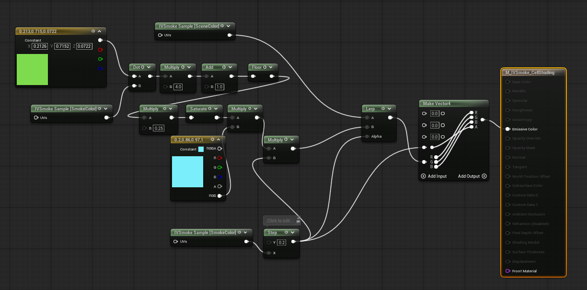
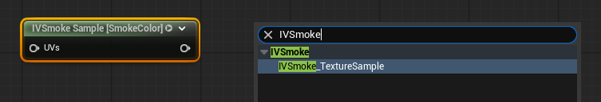
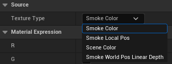
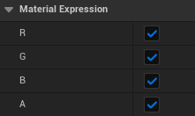
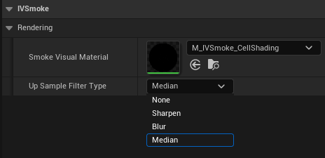

# Custom Material Guide

IVSmoke renders smoke through a built-in composite shader by default. If you want full control over how the smoke is blended with the scene, you can supply your own **Post Process material** and register it via a **Visual Material Preset**. This guide walks through creating the material, wiring up the IVSmoke texture nodes, and registering the preset in Project Settings.

---

## 1. Creating the Material

Create a new material and set its **Material Domain** to **Post Process**. Inside the material, you define how the Scene and Smoke textures are mixed.

### IVSmoke_TextureSample Node

Search for **IVSmoke_TextureSample** in the material palette and add it to your graph. This node gives you access to the smoke render targets.

Select the node and choose a **Texture Type**:

| Texture Type | Channels | Description |
| --- | --- | --- |
| **SmokeColor** | (R, G, B, A) | Smoke albedo color + smoke alpha |
| **SmokeLocalPos** | (X, Y, Z, 0) | Smoke local position |
| **SceneColor** | (R, G, B, A) | Scene color behind the smoke |
| **SmokeWorldPosLinearDepth** | (X, Y, Z, Depth) | Smoke world position + linear depth |

Internally, these textures are mapped to `PostProcessInput[0, 1, 2, 4]` on the SceneTexture node.

Use the **Color Mask** option to select which channels the node outputs:

---

## 2. Creating a Visual Material Preset

The preset is a Data Asset that links your material to the IVSmoke render pipeline.

1. In the **Content Drawer**, right-click and select **Miscellaneous > Data Asset**.
2. Choose **IVSmoke Visual Material Preset** as the class.

### Preset Properties

| Property | Description |
| --- | --- |
| **Smoke Visual Material** | Slot for your custom smoke material. If empty, the built-in composite shader is used. |
| **UpSample Filter Type** | Filter applied after upsampling the ray marching result. See options below. |

**UpSample Filter Type options:**

* **None** — No filtering.
* **Sharpen** — Enhances edges and details, making smoke contours more defined.
* **Blur** — Softens with Gaussian blur for a smooth, natural look.
* **Median** — Removes noise while preserving edges.

---

## 3. Registering the Preset

Open **Edit > Project Settings** and search for **IVSmoke**. In the **Rendering** section, assign your preset to the **Smoke Visual Material Preset** slot.

---

## Example

A working demo preset ships with the plugin:

**Plugins > IVSmoke > DataAssets > D_IVSmoke_VisualMaterialPreset**

---

*Copyright (c) 2026, Team SDB. All rights reserved.*
